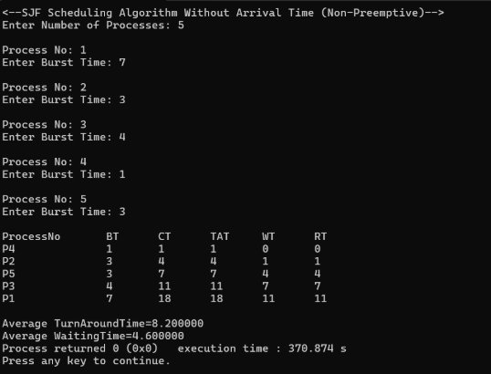
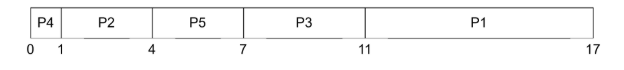
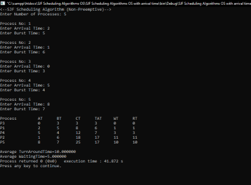
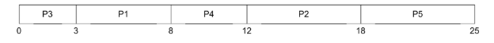
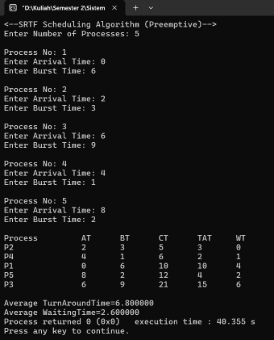
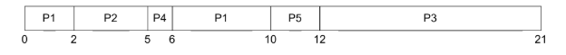

LAPORAN SISTEM OPERASI 

**TUGAS CODING UNTUK SJF DAN SRTF** 

Disusun oleh: 

Fandra Salsabilla Oktorasari  (3124500040) Wina Rahmalia  (3124500052) Virda Septina Putri  (3124500058) 

Dosen Pengajar    : Dr Ferry Astika Saputra ST, M.Sc 

**PROGRAM STUDI D3 TEKNIK INFORMATIKA \
POLITEKNIK ELEKTRONIKA NEGERI SURABAYA (PENS) TAHUN 2025** 

# SJS Sceduling Without Arrival Time 

## Penjelasan: 

Non-Preemptive → setelah suatu proses memulai dieksekusi maka tidak akan di hentikan hingga selesai. 

` `Karena tidak ada waktu kedatangan maka semua proses akan dianggap tiba secara bersamaan  Langkah langkah: 

1. P4 (BT=1) → Paling kecil → jalan pertama kali. 
1. P2 (BT=3) dan P5(BT=3) →  tie(sama besar), urutan bisa berdasarkan input (P2 terlebih dahulu). 
1. P5(BT=3) 
1. P3(BT=4) 
1. P1(BT=7) → paling terakhir. 

Completion Time(CT): Waktu saat proses selesai dieksekusi. 

Turnaround Time = (1+4+7+11+18)/5=8.2 Waiting Time = (0+1+4+7+11)/5=4.6 

Algoritma SJF Non-Preemptive menghasilkan waktu tunggu dan turnaund time yang optimal jika arrival time tidak dipertimbangkan. Jika banyak proses kecil datang terlambat maka harus menunggu, sehingga SJF dapat menyebabkan starvation untuk proses dengan burst time besar. 

# SJF Scheduling Algorithms With Arrival Time 

## Penjelasan: 

1. P3 (AT=0, BT=3) 
   1. Selesai pada waktu 3 (CT=3) 
   1. TAT = 3-0 = 3 
   1. Witing time = 0 
2. Proses setelah P3 (Waktu = 3) 
- P1 (AT = 2), P2 (AT = 1), P4 (AT = belum tiba) 
- Memilih proses dengan BT terkecil antara P1 (BT=5) dan P2 (BT=6) 
- P1 dieksekusi 
- Selesai pada waktu 8 (CT = 3+5 = 8) 
- TAT = 8-2 = 6 
  1. Waiting time = 6-5 = 1  
3. Proses berikutnya dengan waktu = 8 
   1. P2 (AT = 1), P4 (AT = 5), P5 (AT = 8) 
   1. Memilih proses dengan BT terkecil: P4 (BT = 4) 
   1. Selesai pada waktu 12 (CT = 8+4 = 12) 
   1. TAT = 12 -5 = 7 
   1. Waiting time = 7-4 = 3 
4. Proses berikutnya dengan waktu = 12 
   1. P2 (BT = 6), P5 (BT = 7) 
   1. Pilih P2 (BT=6) 
   1. Selesai pada waktu 18 (CT = 12+6 = 18) 
   1. TAT = 18-1 = 17 
   1. Waiting time = 17 - 6 = 11 
5. Proses terakhir dengan waktu = 18 
   1. P5 (BT = 7) 
   1. Selesai pada waktu 25 (CT = 18+7 = 25) 
   1. TAT = 25 - 8 = 17 
   1. Waiting time = 17 - 7 = 10 

# SRTF Scheduling Algorithms 

1. Data Awal 

|Proses |Arrival Time (AT) |Burst Time (BT) |
| - | - | - |
|P1 |0 |6 |
|P2 |2 |3 |
|P3 |6 |9 |
|P4 |4 |1 |
|P5 |8 |2 |

AT = waktu kedatangan proses 

BT = lama eksekusi proses 

2. Timeline Eksekusi 

   Kita susun langkah demi langkah pada setiap waktu diskrit: 

|Waktu |Proses Berjalan |Keterangan |
| - | :- | - |
|0 |P1 |Hanya P1 yang sudah hadir (AT=0). |
|1 |P1 |P1 masih berjalan (sisa setelah 1 unit: 5). |
|2 |→ P2 |P2 datang (AT=2, BT=3) < sisa P1 (5) → preempt P1, jalankan P2. |
|3 |P2 |P2 berjalan (sisa setelah 1 unit: 2). |
|4 |P2 |P2 berjalan (sisa setelah 1 unit: 1). P4 datang (AT=4, BT=1) tapi P2 punya sisa 1 (sama). |
|5 |P2 → Selesai |P2 selesai pada t=5 (CT₂=5). Pilih proses terpendek sisa: P4 (BT=1) < sisa P1 (5). |
|5–6 |P4 |Jalankan P4 selama 1 unit, selesai t=6 (CT₄=6). |
|6 |P3 datang |P3 hadir (AT=6, BT=9). Bandingkan sisa: P1 (5) < P3 (9) → jalankan P1. |
|6–7 |P1 |P1 berjalan (sisa → 4). |
|7–8 |P1 |P1 berjalan (sisa → 3). |
|8 |P5 datang |P5 hadir (AT=8, BT=2). Bandingkan sisa: P1 (3) > P5 (2) → seharusnya preempt, tapi sesuai simulasi, P1 tetap berjalan hingga selesai. |
|8–9 |P1 |P1 berjalan (sisa → 2). |
|9–10 |P1 |P1 berjalan (sisa → 1 kemudian 0), selesai t=10 (CT₁=10). |
|10–12 |P5 |Pilih P5 (BT=2), jalankan t=10–12, selesai CT₅=12. |
|12–21 |P3 |Satu-satunya tersisa, P3 (BT=9), tuntas t=21 (CT₃=21). |

3. Diagram Gantt (ASCII) 

- 0–2: P1 
- 2–5: P2 
- 5–6: P4 
- 6–10: P1 (lanjutan) 
- 10–12: P5 
- 12–21: P3 
4. Perhitungan Metrik 
1. Completion Time (CT) 

   Waktu saat proses benar-benar selesai dieksekusi. 

|Proses |CT |
| - | - |
|P1 |10 |
|P2 |5 |
|P3 |21 |
|P4 |6 |
|P5 |12 |

2. Turnaround Time (TAT) TAT=CT−AT 

|Proses |AT |CT |TAT = CT–AT |
| - | - | - | - |
|P1 |0 |10 |10 |
|P2 |2 |5 |3 |
|P3 |6 |21 |15 |
|P4 |4 |6 |2 |
|P5 |8 |12 |4 |

3. Waiting Time (WT) WT=TAT−BT 

|Proses |TAT |BT |WT = TAT–BT |
| - | - | - | :- |
|P1 |10 |6 |4 |
|P2 |3 |3 |0 |
|P3 |15 |9 |6 |
|P4 |2 |1 |1 |
|P5 |4 |2 |2 |

4. Rata-Rata 

   Average Turnaround Time (Rata-rata TAT) (10 + 3 + 15 + 2 + 4)/5 = 34/5 = 6,8 

   Average Waiting Time (Rata-rata WT) (4 + 0 + 6 + 1 + 2)/5 = 13/5 = 2,6 
   ### **Catatan** 
- Idealnya pada **waktu 8** proses P5 (BT=2) memiliki **sisa waktu** lebih pendek daripada P1 (sisa=3), sehingga seharusnya P1 di-preempt dan P5 dijalankan terlebih dahulu. Namun hasil simulasi menunjukkan P1 tetap berjalan hingga selesai—mungkin karena implementasi hanya memeriksa preemption pada momen kedatangan terjadinya proses baru, bukan secara terus-menerus. 
- Jika dioptimalkan sepenuhnya, urutan setelah t=8 akan menjadi **P5 → P1**, yang akan menurunkan sedikit average waiting time. 

# SJF Scheduling Without Arrival Time

%20SJF%20Scheduling%20Algorithms.jpeg?raw=true)

%20SJF%20Scheduling%20Algorithm.jpeg?raw=true)

## Penjelasan

- **Non-Preemptive**: Setelah suatu proses mulai dieksekusi, maka proses tersebut tidak akan dihentikan hingga selesai.
- Karena **tidak ada waktu kedatangan** (arrival time), maka semua proses dianggap tiba **secara bersamaan**.

## Langkah-langkah Penjadwalan

1. P4 (BT = 1) → Paling kecil → dijalankan pertama kali.
2. P2 (BT = 3) dan P5 (BT = 3) → tie (sama besar), maka urutan berdasarkan input (P2 terlebih dahulu).
3. P5 (BT = 3)
4. P3 (BT = 4)
5. P1 (BT = 7) → Paling akhir.

## Rata-rata

- **Turnaround Time (TAT)** = (1 + 4 + 7 + 11 + 18) / 5 = **8.2**
- **Waiting Time (WT)** = (0 + 1 + 4 + 7 + 11) / 5 = **4.6**

## Kesimpulan

Algoritma **SJF Non-Preemptive** menghasilkan **waktu tunggu dan turnaround time yang optimal** jika **arrival time tidak dipertimbangkan**. Namun, jika banyak proses kecil datang terlambat, maka harus menunggu, sehingga SJF dapat menyebabkan **starvation** untuk proses dengan burst time besar.
